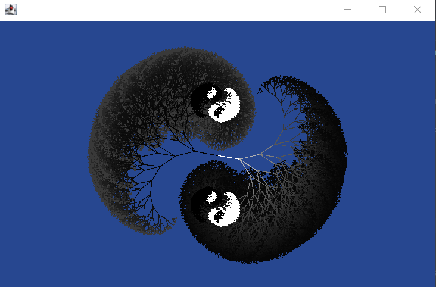

# Fractal Yin-Yang (Recursion)

## [Fractal Yin Yang](src/fadeYinYang.java)



<p>
      Summary of Program: Yin and Yang with transposed colours, that fade into the inverse colour

      A Fractal starts as line that is then split into 3 lines; 2 of the lines are equidistant angles
      from the initial arm, the 3rd line is the middle shifted towards a terminal arm

      Fractal recuses 11 times represented as depth. the line gets darker/lighter each level there are also  2 fish, being Yin and Yang.

      Furthermore, there is another recursive element; the eyes of this fractal are in of itself a fractal. As inverted monochrome Black and white
</p>


---

## Other Recursive Programs I made

### Medium
- [Rectangle Tiles](src/rectangleTiles.java): Find the minimum tiles for a rectangular floor that is to be tiled with square tiles.


```
Find the minimum tiles for a rectangular floor that is to be tiled with square tiles.

Data is input into the DATA3.txt file, and is to be separated by space

The output file OUT3.txt will contain 5 lines, the minimum number of tiles necessary to exactly cover the W by L space.
```
 


### Easy
- [Check Palindrome](src/checkPalindrome.java)
simple recursive function tha determines if a string is a palindrome.